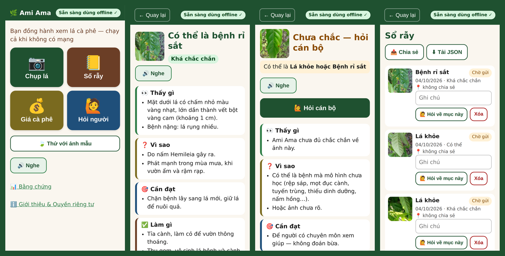
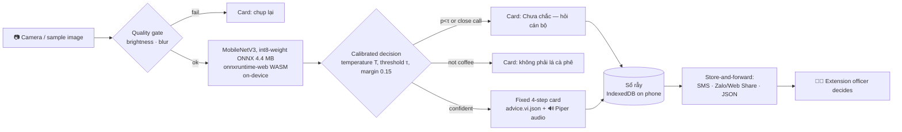

# Ami Ama 🌿 — offline coffee-leaf helper for Tây Nguyên

**Hack-Nation 7 · World Bank "Small AI for Development" · Track B: Agriculture**

> **Because of Ami Ama**, a smallholder robusta farmer in Tây Nguyên will identify a leaf problem and know a safe first step — or know to call a person — **on the same day she sees it**, offline and in Vietnamese, instead of waiting months for an extension visit or guessing; we know because ~640,000 smallholder households produce ~95% of Vietnam's coffee ([Daily Coffee News, Jul 2026](https://dailycoffeenews.com/2026/07/01/report-says-vietnams-robusta-boom-faces-a-reckoning/)) and extension visits are rare.

**Live demo: https://ami-ama.vercel.app** · **Try it in airplane mode** (below) · Code MIT · Model 4.4 MB · works with no network after the first visit.

("Ama"/"Ami" are the Ê Đê words for father/mother — as in Buôn Ma Thuột ← Buôn Ama Thuột.)



## What it does
1. **Chụp lá** — the farmer photographs one coffee leaf (or taps **Thử với ảnh mẫu** to use a test image).
2. An image-quality gate asks for a retake if the photo is blurry/dark; otherwise a **tiny on-device vision model** (MobileNetV3, 4.4 MB ONNX with int8 weights, runs in the browser with WebAssembly) names the likely problem.
3. The app shows a **fixed, source-cited 4-step card** in Vietnamese — **Thấy gì · Vì sao · Cần đạt · Làm gì** — and reads it aloud (🔊 Nghe).
4. If the model is unsure, it says **"Chưa chắc — hỏi cán bộ"** and prepares an SMS/Zalo message for an extension officer (**Hỏi người**, always one tap away).
5. The observation goes into an offline **Sổ rẫy** (field log) with date, result, optional photo and GPS (only with consent), marked "Chờ gửi" until shared.

Also: **Giá cà phê** (a date-stamped reference price table — clearly labelled *not AI*, with a staleness warning), **Bằng chứng** (Evidence: field vs studio metrics, what it can't detect), **Giới thiệu & Quyền riêng tư**.

Persona (fictional): chị H'Nơ, 38, Ê Đê, 2 ha robusta in Krông Pắc, Đắk Lắk; shares her daughter's smartphone; no Wi-Fi; an extension officer visits ~twice a year.

## Try it in airplane mode (Android + Chrome)
1. Open the live URL once on Wi-Fi/4G. Tap **Bắt đầu**. Wait for the green **"Sẵn sàng dùng offline ✓"** badge (≈ 20 MB, one time).
2. Optional: Chrome menu → **Add to Home screen** (installs as an app).
3. Turn on **airplane mode**. Close and reopen the app.
4. Tap **Thử với ảnh mẫu** → any leaf → result card + 🔊 Nghe. Or **Chụp lá** → photograph a real leaf.
5. Tap **Lưu vào sổ rẫy**, then **Sổ rẫy** — the entry is there after a reload, still offline.
6. Tap **Hỏi cán bộ** → **Gửi SMS** opens the SMS app with the message pre-filled (it sends when the phone has signal).

## Why AI (and not SMS, a spreadsheet or web search)?
- **SMS can't see a leaf.** The farmer's question *is* a photo; describing spots in words needs vocabulary and literacy many farmers don't have.
- **Search needs data and literacy**, returns pesticide ads and arabica pages, and doesn't work in the field without signal.
- **A lookup table can't read pixels.** Recognising rust vs mite vs healthy from a phone photo is exactly what a small vision model does well — and it fits in 5 MB and runs offline.
- The AI is kept **narrow**: it only *chooses* among fixed cards written from public extension sources; everything it says was written and cited by people. Voice output serves low-literacy users.

## Architecture

Everything inside the phone is precached by a service worker (app, model, WASM runtime, audio, samples). No backend, no API keys, no analytics; Vercel only serves static files.

## Datasets
| Dataset | License | Used | What it is | What it does **not** cover |
|---|---|---|---|---|
| [RoCoLe](https://data.mendeley.com/datasets/c5yvn32dzg/2) (Parraga-Alava et al., 2019) | CC BY 4.0 | all 1,560 | **Robusta**, real field smartphone photos, Ecuador: healthy, rust (levels 1–4), red spider mite | Vietnamese plants; any other problem |
| [JMuBEN](https://huggingface.co/datasets/Project-AgML/arabica_coffee_leaf_disease_classification) (Jepkoech et al., 2021, via AgML) | CC BY 4.0 | 6,000 of 58,549 | **Arabica**, Kenya, 128-px studio-like crops: cercospora, healthy, rust, leaf miner, phoma | Robusta; real field conditions |
| [iBean / beans](https://huggingface.co/datasets/AI-Lab-Makerere/beans) (Makerere AI Lab) | MIT | all 1,295 | Bean leaves, used only as "not a coffee leaf" | Other non-coffee objects (soil, hands, other crops) |

Not detected at all: rệp sáp & mọt đục quả (fruit pests), mọt đục cành (twig borers), tuyến trùng (nematodes), nutrient deficiencies, nấm hồng (pink disease), thán thư/khô cành (anthracnose/dieback). Details: [docs/DATA_CARD.md](docs/DATA_CARD.md).

## Evidence — does it work?
<!-- METRICS:START (generated by ml/report_md.py) -->
Shipped model: `leaf_v1.int8.onnx`, **4.40 MB** (int8 weight-only per-channel (fp32 activations/compute)), temperature T=0.61, abstain threshold τ=0.82.

| | **Field** — RoCoLe test (robusta, Ecuador, grouped by plant) | Studio — JMuBEN test (arabica, Kenya) | All test (incl. beans) |
|---|---|---|---|
| Images | 312 | 900 | 1407 |
| Accuracy (all photos) | 83.7% | 98.6% | 95.5% |
| Macro-F1 (classes present) | 0.736 | 0.985 | 0.899 |
| Coverage at τ=0.82 (rest → "hỏi cán bộ") | 74.7% | 95.0% | 91.1% |
| Accuracy on answered photos | 91.4% | 99.7% | 98.2% |
| ECE before → after calibration | 0.071 → 0.075 | 0.119 → 0.025 | 0.099 → 0.009 |

On **real field photos** (RoCoLe test, plants never seen in training) the model answers 74.7% of photos and is right on 91.4% of those; the rest get "Chưa chắc — hỏi cán bộ". These are Ecuadorian robusta photos — **we have no Vietnamese test photos yet**, so treat this as an upper bound. Temperature scaling was fitted on all validation sources together; on the field split it did **not** improve ECE (0.071 → 0.075). **Per-class safety gate:** classes whose precision among accepted field-val predictions is below 80% are never asserted (now: red_spider_mite) — they show 'Chưa chắc — hỏi cán bộ' with a 'Có thể là …' hint; the numbers above include this. **Not-a-coffee-leaf check:** on 58 openly licensed real photos of other things (soil, sky, hands, grass, pepper/durian/banana/cashew leaves) 10 (17%) were wrongly given a coffee-leaf result and 42 abstained — a known weakness (the negative class only saw bean leaves). Full report: [docs/MODEL_CARD.md](docs/MODEL_CARD.md) (per-class, confusion matrices, risk–coverage, quantization).
<!-- METRICS:END -->

## Responsible AI (pass/fail items)
- **Fixed answer library** — the model only picks one of 7 class ids; all text comes from `content/advice.vi.json` (with sources). No generative model anywhere.
- **Calibrated abstain** — temperature scaling + threshold τ chosen on *field* validation photos; close calls (top-1 − top-2 < 0.15) also abstain → "Chưa chắc — hỏi cán bộ".
- **Human in the loop** — "Hỏi người" on the home screen, on every result, in every log entry; SMS works to any phone.
- **No pesticide brands or doses**; every card ends with "ask an officer, only registered products, follow the label".
- **Privacy** — on-device inference, no telemetry; photo storage and GPS are **opt-in** (off by default); delete-all; shared/lost-phone note.
- **Honest limits** in-app (Evidence screen) and in [docs/RESPONSIBLE_AI.md](docs/RESPONSIBLE_AI.md), [docs/MODEL_CARD.md](docs/MODEL_CARD.md).

## Language
Vietnamese text + pre-recorded Vietnamese voice (Piper `vi_VN-vais1000-medium`). For the brief's "less-supported language" question: **Bahnar (Ba Na, `bdq`)** has Meta MMS speech models, so the app ships a ready language-pack slot (`src/i18n/bdq.json`) that needs a native speaker to fill; **Ê Đê and Jarai are not covered** by MMS and would need community recordings. We deliberately did not machine-translate. → [docs/LANGUAGE.md](docs/LANGUAGE.md)

## Scalability & replicability
- **Crop packs**: same pipeline (`ml/`) for pepper, durian, cashew — swap the datasets + advice JSON; the app is data-driven (`labels.json`, `advice.*.json`, `model_card.json`).
- **Language packs**: `src/i18n/<code>.json` + `content/advice.<code>.json` + recorded audio.
- **Cooperative deployment**: one lead farmer installs it on a few shared phones; logs flow to the officer via SMS/Zalo/JSON; officer-confirmed photos become a Vietnamese field set → retrain (`make -C ml all`).
- **Plot log for EUDR**: the EU Deforestation Regulation applies from 30 Dec 2026 (large/medium) / 30 Jun 2027 (micro/small) and needs plot geolocation ([SGS](https://ecustoms.sgs.com/2025/11/27/eudr-officially-postponed-new-deadlines-set-for-2026-and-2027/)); the consented GPS in Sổ rẫy is a first step toward a farmer-owned plot record.
- Context: > 80% of Vietnamese use smartphones ([VietnamNet / NSO](https://vietnamnet.vn/en/more-than-80-of-vietnam-s-population-uses-smartphones-2537308.html)); 2.6 B people are offline and internet use is 27% in low-income countries (World Bank challenge brief).

**What's next:** Vietnamese field photos labelled by officers; real-phone latency study on low-end Android; Bahnar pack with a native speaker; officer review of the advice library; severity hint for rust.

## Run locally
```bash
npm ci
npm run dev            # http://localhost:5173 (copies the ORT wasm into public/ort first)
npm run build && npm run preview   # production build + service worker on :4173
npx playwright test    # offline e2e (uses Chromium at /opt/pw-browsers/chromium or $PW_CHROMIUM)
```
Deploy: import the repo on Vercel (framework Vite, build `npm run build`, output `dist`; `vercel.json` included).

## Retrain the model
```bash
python3.11 -m venv .venv && .venv/bin/pip install -r ml/requirements.txt
make -C ml all PY=../.venv/bin/python   # download → prepare → train → evaluate → export → verify → samples
```
CPU-only works (~1–1.5 h on 4 cores); GPU notebook: `ml/train_colab.ipynb`. Seed 42; split manifests in `ml/splits/`; reports in `ml/reports/`.

## Regenerate audio
```bash
python3 -m venv .ttsvenv && .ttsvenv/bin/pip install piper-tts
.ttsvenv/bin/python tools/tts/generate.py   # needs ffmpeg; writes public/audio/vi/*.ogg|mp3
```

## Docs
[SPEC](docs/SPEC.md) · [PLAN](docs/PLAN.md) · [PROGRESS](docs/PROGRESS.md) · [DATA_CARD](docs/DATA_CARD.md) · [MODEL_CARD](docs/MODEL_CARD.md) · [RESPONSIBLE_AI](docs/RESPONSIBLE_AI.md) · [LANGUAGE](docs/LANGUAGE.md) · [ACCEPTANCE](docs/ACCEPTANCE.md)

## Credits & licenses
- Code: **MIT** (see `LICENSE`).
- RoCoLe — Parraga-Alava, Cusme, Loor, Santander (2019), Mendeley Data DOI 10.17632/c5yvn32dzg.2, **CC BY 4.0**. Sample images cropped/resized.
- JMuBEN — Jepkoech, Mugo, Kenduiywo, Chebet (2021), *Data in Brief* 36:107142; via Project-AgML on Hugging Face, **CC BY 4.0**. Sample images resized.
- iBean — Makerere AI Lab, **MIT**.
- Voice — Piper `vi_VN-vais1000-medium` (rhasspy/piper-voices), trained on VAIS-1000, **CC BY 4.0**.
- Runtime — onnxruntime-web (MIT), React (MIT), Workbox (MIT), idb-keyval (Apache-2.0).
- Advice text — written from the public sources cited on each card (Báo Nông nghiệp và Môi trường, Chi cục Trồng trọt và BVTV Lâm Đồng, Trung tâm Khuyến nông Kon Tum, NBAIR, Plantix, peer-reviewed reviews). **Draft — needs review by a plant-protection/extension officer before real use.**
