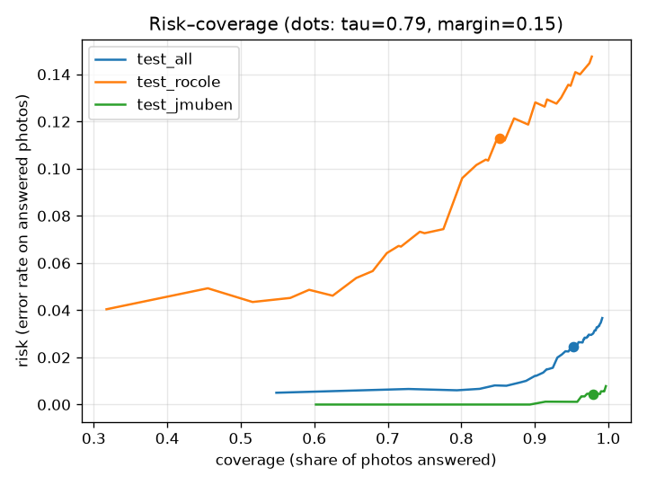
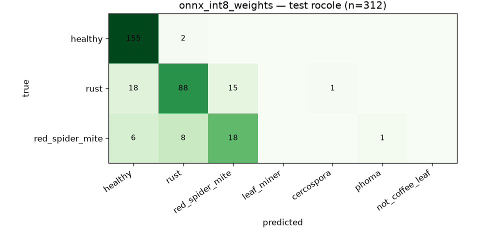

# Model card — `leaf_v2`

*Generated by `ml/report_md.py` from `ml/reports/` and `public/models/model_card.json`. Do not edit numbers by hand.*

## Summary
| | |
|---|---|
| Task | 7-way classification of one coffee-leaf photo: healthy, rust, red_spider_mite, leaf_miner, cercospora, phoma, not_coffee_leaf |
| Architecture | `mobilenetv3_large_100` (timm, ImageNet-pretrained), 224×224 input |
| Shipped file | `public/models/leaf_v1.int8.onnx` — **4.40 MB**, int8 weight-only per-channel (fp32 activations/compute) (file name kept stable across versions; the version is `leaf_v2`) |
| SHA-256 | `ce445886aa4a77471cc02cbcd39a0f4c9b1a9d86fe987acbc1ecd9fec431c64f` |
| Runtime | onnxruntime-web (WASM, 1 thread) in the browser; same ONNX in onnxruntime (Python) for evaluation |
| Calibration | temperature **T = 0.597** (fitted on val, all sources) |
| Abstain rule | threshold **τ = 0.79**, margin 0.15 — target met (target accuracy on answered RoCoLe-val photos: 0.9) |
| Training data | RoCoLe (all), JMuBEN (1,200/class subsample), beans — see [DATA_CARD](DATA_CARD.md) |
| Split | RoCoLe 60/20/20 grouped by plant; JMuBEN & beans 70/15/15 stratified; seed 42 |

## Headline metrics (shipped model, held-out test sets)
| | **Field** — RoCoLe test (robusta, Ecuador, grouped by plant) | Studio — JMuBEN test (arabica, Kenya) | All test (incl. beans) |
|---|---|---|---|
| Images | 312 | 900 | 1457 |
| Accuracy (all photos) | 83.7% | 99.2% | 95.8% |
| Macro-F1 (classes present) | 0.756 | 0.993 | 0.911 |
| Coverage at τ=0.79 (rest → "hỏi cán bộ") | 79.2% | 97.9% | 93.9% |
| Accuracy on answered photos | 91.1% | 99.6% | 98.1% |
| ECE before → after calibration | 0.079 → 0.076 | 0.103 → 0.017 | 0.091 → 0.015 |

The **field** column is the number that matters: real smartphone photos of robusta leaves, and no plant in the test set was seen in training. It only covers healthy / rust / red spider mite. The **studio** column is optimistic (low-res, uniform crops, likely near-duplicates). **No Vietnamese photos were available**, so real-world accuracy in Tây Nguyên is unknown and probably lower.

## leaf_v2 vs leaf_v1 — merge decision (rule fixed before training, `ml/compare_v2.py`)
Ship only if field accuracy-on-answered and field coverage each drop by ≤ 1 pt **and** confident-wrong answers on the 58 held-out non-coffee photos go down.

| | leaf_v1 | leaf_v2 | check |
|---|---|---|---|
| Field (RoCoLe test) accuracy on answered | 91.4% | 91.1% | ✅ |
| Field coverage | 74.7% | 79.2% | ✅ |
| Held-out OOD confident-wrong | 10/58 | 1/58 | ✅ |
| Field accuracy (all photos) / macro-F1 | 83.7% / 0.736 | 83.7% / 0.756 | |
| Studio (JMuBEN) accuracy | 98.6% | 99.2% | |
| τ / T / never asserted | 0.82 / 0.607 / red_spider_mite | 0.79 / 0.597 / red_spider_mite | |

Decision: **ship leaf_v2**. leaf_v1 reports remain in `ml/reports/`; leaf_v2 reports are in `ml/reports/v2/`.

## Per-class safety gate
Rule: a class is **never asserted** when its precision among *accepted* predictions on the RoCoLe (field) **validation** split is below **0.80**. A confident prediction of such a class is shown as the "Chưa chắc — hỏi cán bộ" card with the hint "Có thể là <class>" and the escalation button. Same rule in `ml/common.py::decide` and `src/ml/decide.ts`; the list ships in `model_card.json` (`never_assert`). All metrics above already include the gate.

| class | RoCoLe **val** precision (accepted) | n accepted | RoCoLe **test** precision (accepted) | n accepted | decision |
|---|---|---|---|---|---|
| healthy | 0.966 | 145 | 0.902 | 164 | asserted |
| rust | 0.897 | 78 | 0.928 | 83 | asserted |
| red_spider_mite | 0.640 | 25 | 0.579 | 19 | **never asserted** → "Có thể là …" + Hỏi cán bộ |

Never asserted: **red_spider_mite**. Leaf miner, cercospora and phoma have **no field photos**; the model made no accepted field predictions of them (no false alarms on RoCoLe), so their field precision cannot be measured. Their studio-only precision (all-source val) is leaf_miner 0.989 (n=180), cercospora 1.000 (n=177), phoma 1.000 (n=178). Their advice cards already say an officer must confirm.

Risk–coverage (test): 

## Per-class — field (RoCoLe test)
| class | precision | recall | F1 | support |
|---|---|---|---|---|
| healthy | 0.866 | 0.987 | 0.923 | 157 |
| rust | 0.898 | 0.721 | 0.800 | 122 |
| red_spider_mite | 0.545 | 0.545 | 0.545 | 33 |

Confusion matrix — field (rows = truth):

| true \ predicted | healthy | rust | red_spider_mite | leaf_miner | cercospora | phoma | not_coffee_leaf |
|---|---|---|---|---|---|---|---|
| **healthy** | 155 | 2 | 0 | 0 | 0 | 0 | 0 |
| **rust** | 18 | 88 | 15 | 0 | 1 | 0 | 0 |
| **red_spider_mite** | 6 | 8 | 18 | 0 | 0 | 1 | 0 |

## Per-class — studio (JMuBEN test)
| class | precision | recall | F1 | support |
|---|---|---|---|---|
| healthy | 1.000 | 1.000 | 1.000 | 180 |
| rust | 1.000 | 0.967 | 0.983 | 180 |
| leaf_miner | 0.989 | 1.000 | 0.994 | 180 |
| cercospora | 0.989 | 1.000 | 0.994 | 180 |
| phoma | 0.989 | 0.994 | 0.992 | 180 |

## Not-a-coffee-leaf (beans test)
Accuracy 100.0% on 195 bean-leaf photos. Untested on soil, hands, other crops.

## Out-of-distribution check (`ml/ood_check.py`, `ml/reports/ood.json`)
Outcome as a farmer would see it for a camera photo (quality gate first, then the model with τ and the class gate):

| set / group | wrong assertion | abstain | not coffee | retake |
|---|---|---|---|---|
| synthetic/solid | 0 | 0 | 0 | 6 |
| synthetic/noise | 0 | 2 | 1 | 0 |
| synthetic/gradient | 0 | 0 | 0 | 2 |
| synthetic/checkerboard | 1 | 0 | 0 | 0 |
| synthetic/soil | 0 | 1 | 0 | 0 |
| synthetic/blurred | 0 | 0 | 0 | 3 |
| commons/sky | 0 | 0 | 2 | 0 |
| commons/soil | 0 | 0 | 8 | 0 |
| commons/hands | 0 | 0 | 8 | 0 |
| commons/grass | 0 | 1 | 6 | 1 |
| commons/pepper_leaves | 0 | 0 | 8 | 0 |
| commons/durian_leaves | 0 | 0 | 8 | 0 |
| commons/banana_leaves | 1 | 1 | 6 | 0 |
| commons/cashew_leaves | 0 | 4 | 4 | 0 |

**Real photos (Wikimedia Commons, 58 images, CC0/PD/CC BY/CC BY-SA — sources in `ml/reports/ood_sources.json`): 1 of 58 (2%) were confidently labelled as a coffee problem** (rust ×1); 6 abstained, 50 'not coffee', 1 retake. Synthetic images (16: solid colours, noise, gradients, checkerboard, soil texture, blurred leaves): 1 wrong assertion(s) (checkerboard → healthy); 11 stopped by the quality gate, 3 abstain, 1 'not coffee'.

The `not_coffee_leaf` class now also learns from 331 openly licensed Commons negatives (grass, soil, sky, hands, banana/cashew/other crop leaves) — different files from this held-out test (see DATA_CARD). v1, trained on bean leaves only, wrongly asserted 10 of these 58 photos.
Mitigations in any case: the advice cards recommend only low-risk cultural practices and always show 'Hỏi cán bộ'.

## Rust severity (metadata only, not shown to farmers)
Recall of class *rust* on RoCoLe test by annotated severity: level 1: 56.5% (n=69) · level 2: 97.1% (n=34) · level 3: 92.3% (n=13) · level 4: 66.7% (n=6).

## Quantization
| variant | size | RoCoLe test acc | JMuBEN test acc | drop vs fp32 (RoCoLe / JMuBEN) | ≤ 2 pts & ≤ 6 MB |
|---|---|---|---|---|---|
| onnx_int8_weights **(shipped)** | 4.40 MB | 83.7% | 99.2% | +0.6 / +0.2 pts | yes |
| onnx_fp32 | 16.83 MB | 84.3% | 99.4% | +0.0 / +0.0 pts | no |

Verification (`ml/verify_onnx.py`, 20 test images): PyTorch vs ONNX fp32 max |Δlogit| = 0.000; shipped vs PyTorch top-1 agreement = 100.0%, max |Δp| = 0.005; result: **PASS**.

## Training
- Optimizer AdamW (backbone 3e-4, head 1e-3, wd 0.02), one-cycle cosine schedule, label smoothing 0.1, batch 48, `WeightedRandomSampler` balancing classes and sources within a class.
- fine-tuned from leaf_v1 weights (checkpoints/best.pt) for 3 epochs with added negatives
- Epochs run: 3 (first 0 with frozen backbone); selection = mean(val macro-F1 all, val macro-F1 RoCoLe); best epoch 2 (val macro-F1 0.901, RoCoLe-val macro-F1 0.737).
- Hardware: 4-vCPU cloud container, no GPU (~10 min total).

## Intended use
A first-step helper for smallholder robusta farmers and extension workers: suggests which of a few common leaf problems a photo shows and links to fixed, cited advice. **Not** a diagnosis, not for pesticide decisions, not for fruit/stem/root problems.

## Limitations
- Not covered: Vietnamese field photos, fruit/cherry pests (rệp sáp, mọt đục quả), stem borers (mọt đục cành), root problems (tuyến trùng), nutrient deficiencies, pink disease (nấm hồng), anthracnose/khô cành.
- leaf_miner / cercospora / phoma learnt only from arabica studio crops (single source) → possible source shortcut; officer confirmation required (stated on the cards).
- Calibration and τ were fitted on RoCoLe/JMuBEN/beans val data; they will drift on Vietnamese photos → recalibrate with officer-labelled local photos.
- Confidently wrong answers are possible; the advice library is limited to low-risk cultural practices and always shows the "ask an officer" path.
