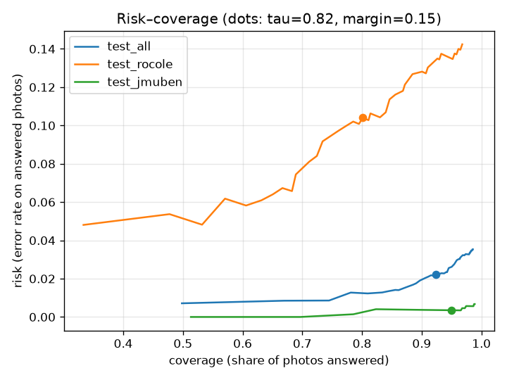
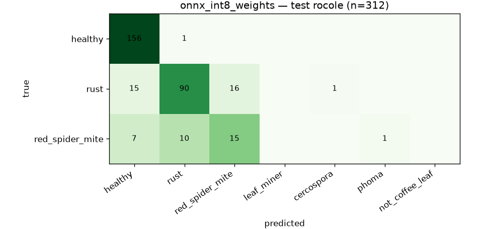
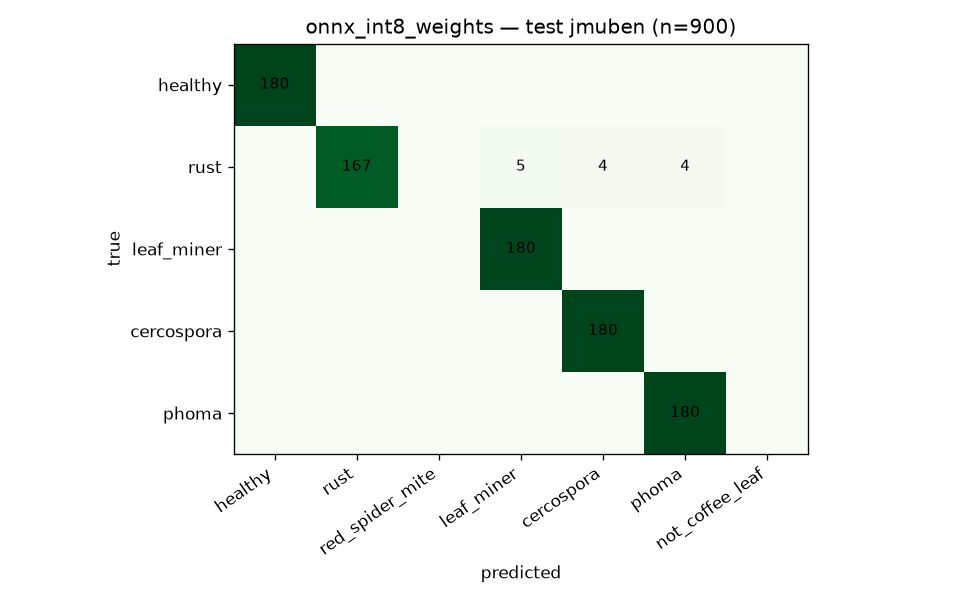

# Model card — `leaf_v1`

*Generated by `ml/report_md.py` from `ml/reports/` and `public/models/model_card.json`. Do not edit numbers by hand.*

## Summary
| | |
|---|---|
| Task | 7-way classification of one coffee-leaf photo: healthy, rust, red_spider_mite, leaf_miner, cercospora, phoma, not_coffee_leaf |
| Architecture | `mobilenetv3_large_100` (timm, ImageNet-pretrained), 224×224 input |
| Shipped file | `public/models/leaf_v1.int8.onnx` — **4.40 MB**, int8 weight-only per-channel (fp32 activations/compute) |
| SHA-256 | `ec558c1dd6f6f010af54e48a2759caa3b0d1817d0acee8142eb2e1157f343326` |
| Runtime | onnxruntime-web (WASM, 1 thread) in the browser; same ONNX in onnxruntime (Python) for evaluation |
| Calibration | temperature **T = 0.607** (fitted on val, all sources) |
| Abstain rule | threshold **τ = 0.82**, margin 0.15 — target met (target accuracy on answered RoCoLe-val photos: 0.9) |
| Training data | RoCoLe (all), JMuBEN (1,200/class subsample), beans — see [DATA_CARD](DATA_CARD.md) |
| Split | RoCoLe 60/20/20 grouped by plant; JMuBEN & beans 70/15/15 stratified; seed 42 |

## Headline metrics (shipped model, held-out test sets)
| | **Field** — RoCoLe test (robusta, Ecuador, grouped by plant) | Studio — JMuBEN test (arabica, Kenya) | All test (incl. beans) |
|---|---|---|---|
| Images | 312 | 900 | 1407 |
| Accuracy (all photos) | 83.7% | 98.6% | 95.5% |
| Macro-F1 (classes present) | 0.736 | 0.985 | 0.899 |
| Coverage at τ=0.82 (rest → "hỏi cán bộ") | 80.1% | 95.0% | 92.3% |
| Accuracy on answered photos | 89.6% | 99.7% | 97.8% |
| ECE before → after calibration | 0.071 → 0.075 | 0.119 → 0.025 | 0.099 → 0.009 |

The **field** column is the number that matters: real smartphone photos of robusta leaves, and no plant in the test set was seen in training. It only covers healthy / rust / red spider mite. The **studio** column is optimistic (low-res, uniform crops, likely near-duplicates). **No Vietnamese photos were available**, so real-world accuracy in Tây Nguyên is unknown and probably lower.

Risk–coverage (test): 

## Per-class — field (RoCoLe test)
| class | precision | recall | F1 | support |
|---|---|---|---|---|
| healthy | 0.876 | 0.994 | 0.931 | 157 |
| rust | 0.891 | 0.738 | 0.807 | 122 |
| red_spider_mite | 0.484 | 0.455 | 0.469 | 33 |

Confusion matrix — field (rows = truth):

| true \ predicted | healthy | rust | red_spider_mite | leaf_miner | cercospora | phoma | not_coffee_leaf |
|---|---|---|---|---|---|---|---|
| **healthy** | 156 | 1 | 0 | 0 | 0 | 0 | 0 |
| **rust** | 15 | 90 | 16 | 0 | 1 | 0 | 0 |
| **red_spider_mite** | 7 | 10 | 15 | 0 | 0 | 1 | 0 |

## Per-class — studio (JMuBEN test)
| class | precision | recall | F1 | support |
|---|---|---|---|---|
| healthy | 1.000 | 1.000 | 1.000 | 180 |
| rust | 1.000 | 0.928 | 0.963 | 180 |
| leaf_miner | 0.973 | 1.000 | 0.986 | 180 |
| cercospora | 0.978 | 1.000 | 0.989 | 180 |
| phoma | 0.978 | 1.000 | 0.989 | 180 |

## Not-a-coffee-leaf (beans test)
Accuracy 100.0% on 195 bean-leaf photos. Untested on soil, hands, other crops.

## Rust severity (metadata only, not shown to farmers)
Recall of class *rust* on RoCoLe test by annotated severity: level 1: 60.9% (n=69) · level 2: 94.1% (n=34) · level 3: 84.6% (n=13) · level 4: 83.3% (n=6).

## Quantization
| variant | size | RoCoLe test acc | JMuBEN test acc | drop vs fp32 (RoCoLe / JMuBEN) | ≤ 2 pts & ≤ 6 MB |
|---|---|---|---|---|---|
| onnx_int8_static | 4.68 MB | 76.3% | 65.4% | +8.7 / +33.3 pts | no |
| onnx_int8_static_pct | 4.68 MB | 79.8% | 91.8% | +5.1 / +7.0 pts | no |
| onnx_int8_dynamic | 4.42 MB | 62.8% | 37.8% | +22.1 / +61.0 pts | no |
| onnx_int8_weights **(shipped)** | 4.40 MB | 83.7% | 98.6% | +1.3 / +0.2 pts | yes |
| onnx_fp32 | 16.83 MB | 84.9% | 98.8% | +0.0 / +0.0 pts | no |

Verification (`ml/verify_onnx.py`, 20 test images): PyTorch vs ONNX fp32 max |Δlogit| = 0.000; shipped vs PyTorch top-1 agreement = 100.0%, max |Δp| = 0.023; result: **PASS**.

## Training
- Optimizer AdamW (backbone 3e-4, head 1e-3, wd 0.02), one-cycle cosine schedule, label smoothing 0.1, batch 48, `WeightedRandomSampler` balancing classes and sources within a class.
- Epochs run: 9 (first 1 with frozen backbone); selection = mean(val macro-F1 all, val macro-F1 RoCoLe); best epoch 7 (val macro-F1 0.907, RoCoLe-val macro-F1 0.751).
- Hardware: 4-vCPU cloud container, no GPU (~51 min total).
- PyTorch fp32 reference: field acc 84.9%, studio acc 98.8%.

## Intended use
A first-step helper for smallholder robusta farmers and extension workers: suggests which of a few common leaf problems a photo shows and links to fixed, cited advice. **Not** a diagnosis, not for pesticide decisions, not for fruit/stem/root problems.

## Limitations
- Not covered: Vietnamese field photos, fruit/cherry pests (rệp sáp, mọt đục quả), stem borers (mọt đục cành), root problems (tuyến trùng), nutrient deficiencies, pink disease (nấm hồng), anthracnose/khô cành.
- leaf_miner / cercospora / phoma learnt only from arabica studio crops (single source) → possible source shortcut; officer confirmation required (stated on the cards).
- Calibration and τ were fitted on RoCoLe/JMuBEN/beans val data; they will drift on Vietnamese photos → recalibrate with officer-labelled local photos.
- Confidently wrong answers are possible; the advice library is limited to low-risk cultural practices and always shows the "ask an officer" path.
